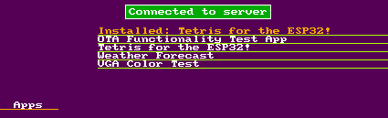

# ESP32_TV
This is the parent repository of all the projects that were used to create the ESP32-based smart TV.

This project was created for my university dissertation. For me, it wasn't really something to do for the dissertation but rather the opposite; the dissertation gave me a good reason and a hard deadline to work on a large project that involves the ESP32, and in my opinion it has paid off in the end.

This ESP32-based solution is a proof of concept which aims to reduce e-waste by integrating a (relatively) inexpensive ESP32-based PCB with an older TV, bringing it more inline with the modern world, and saving it from ending up in a scrapyard.

The software makes heavy use of bitluni's ESP32Lib library (https://github.com/bitluni/ESP32Lib) which provides VGA output functionality using one of the I2S channels.

The main program running on the ESP32 is a "main menu", which has a list of options to choose from, with features such as Internet radio, RSS news and downloadable apps:

Internet radio menu:

RSS news menu:

Downloadable apps menu:

Two apps, a weather app and a Tetris game, have been written as a proof of concept to showcase an "app store", and the ability to install an app to a separate OTA partition on the ESP32.

Weather app:

Tetris game:

Long after I finished the dissertation project, I wrote a small game for a gamejam, called "Jewels!", and I thought that it's definitely possible to port it to the ESP32. So a third app was added to the "app store":

